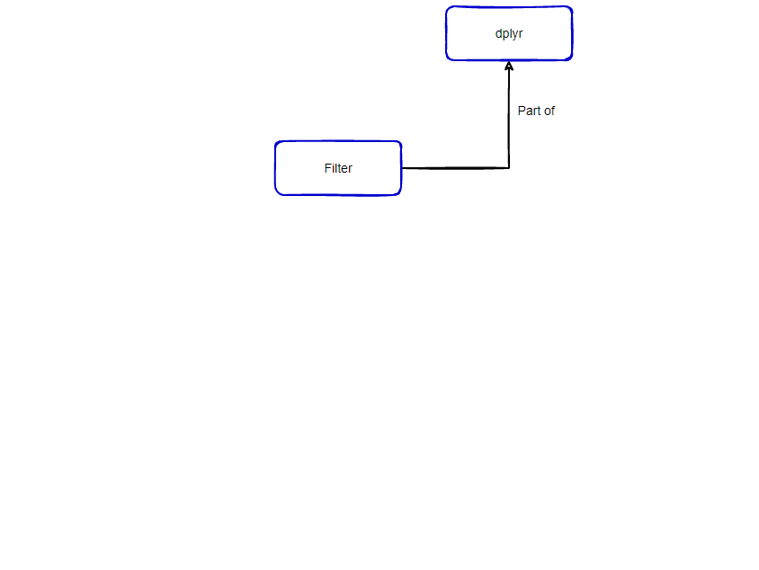
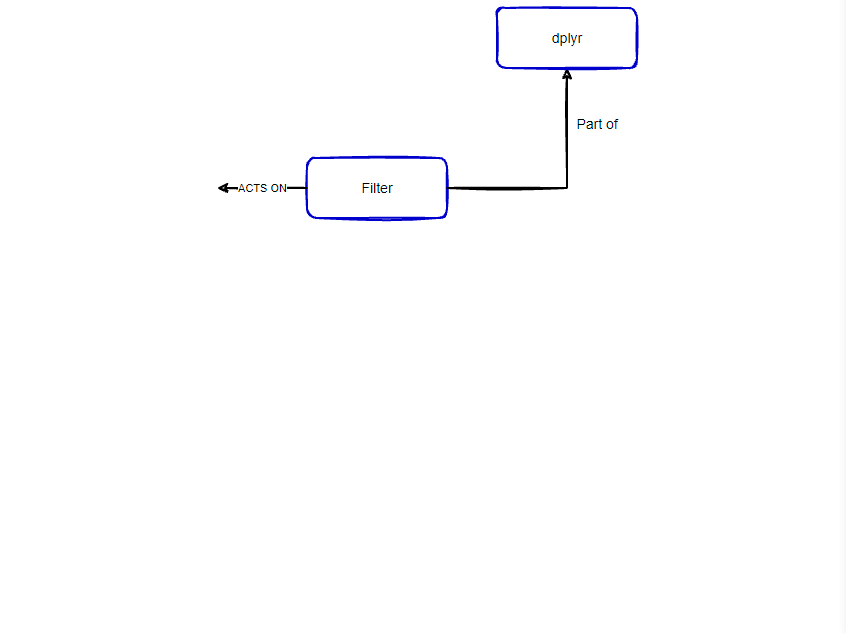
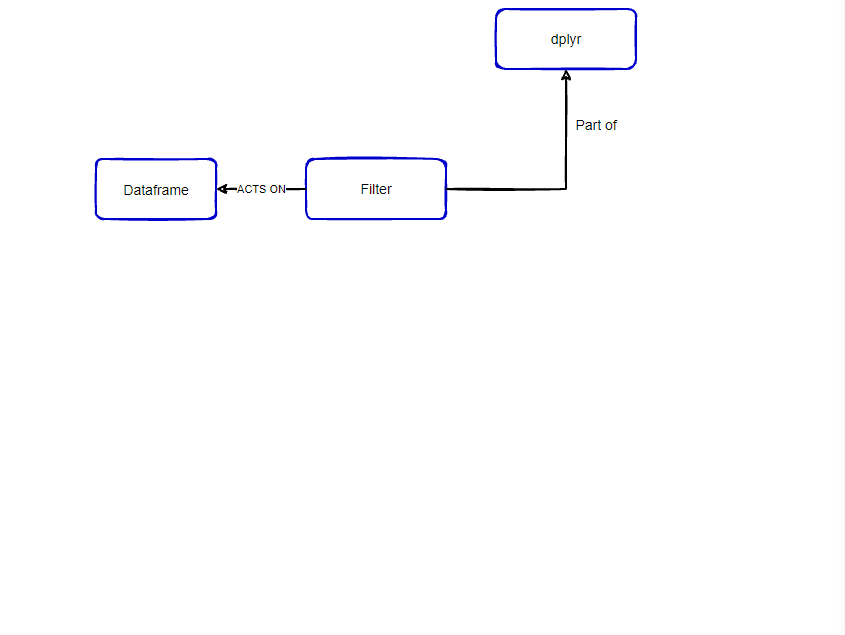
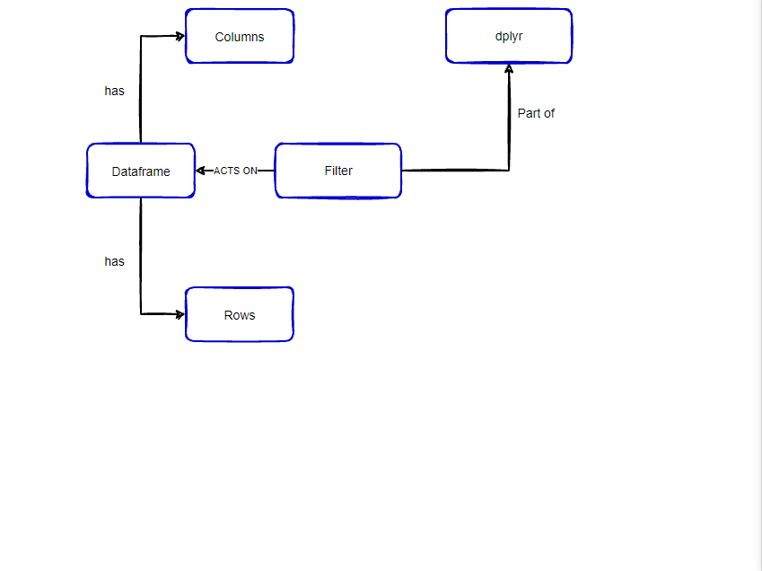
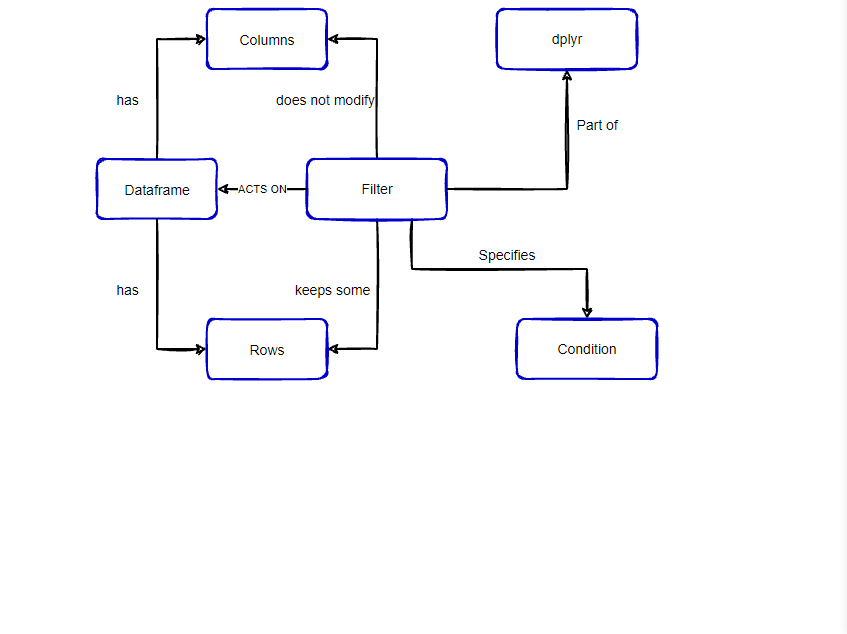
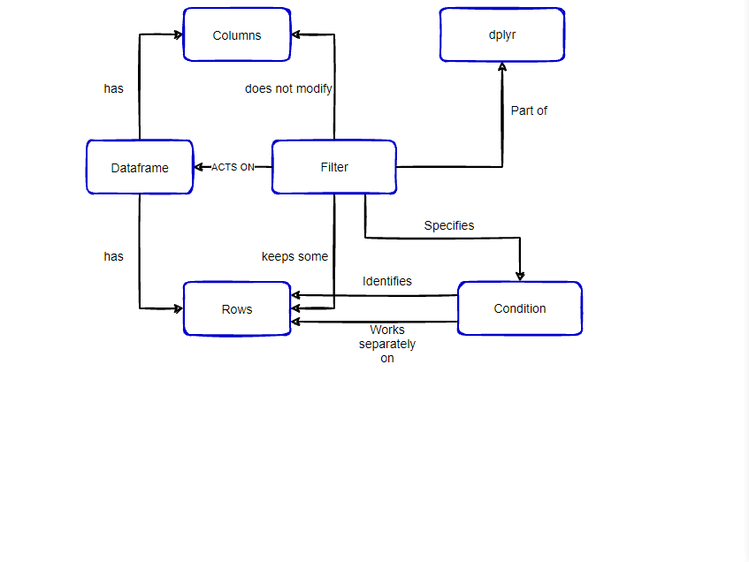
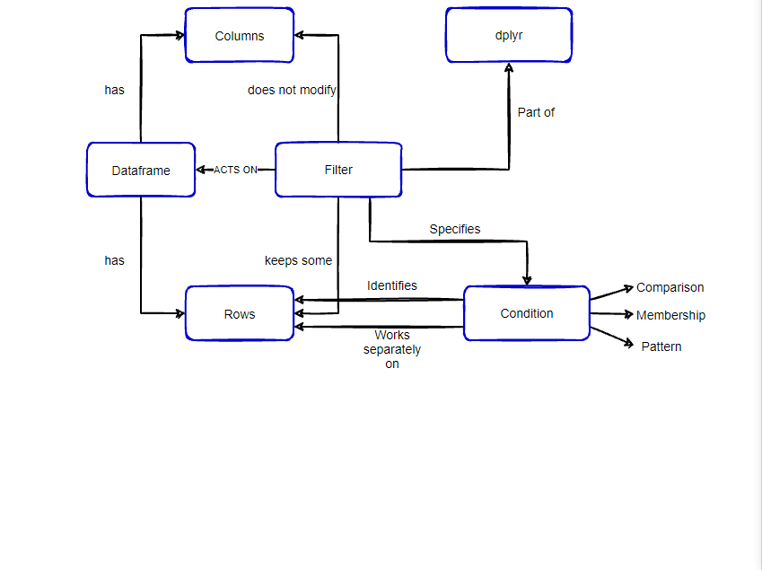
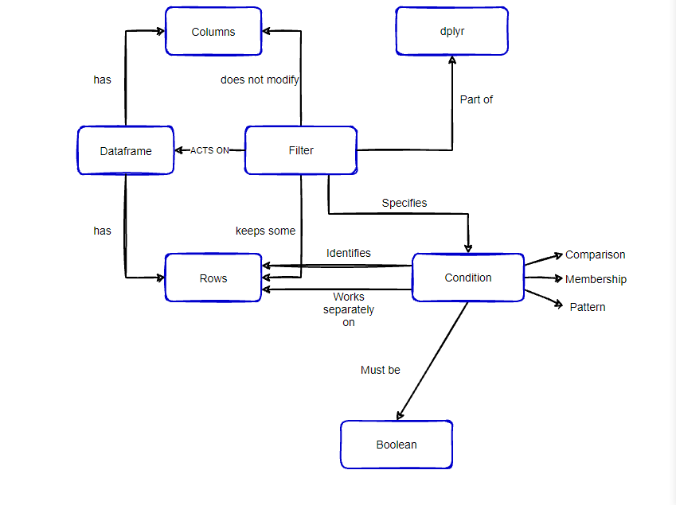
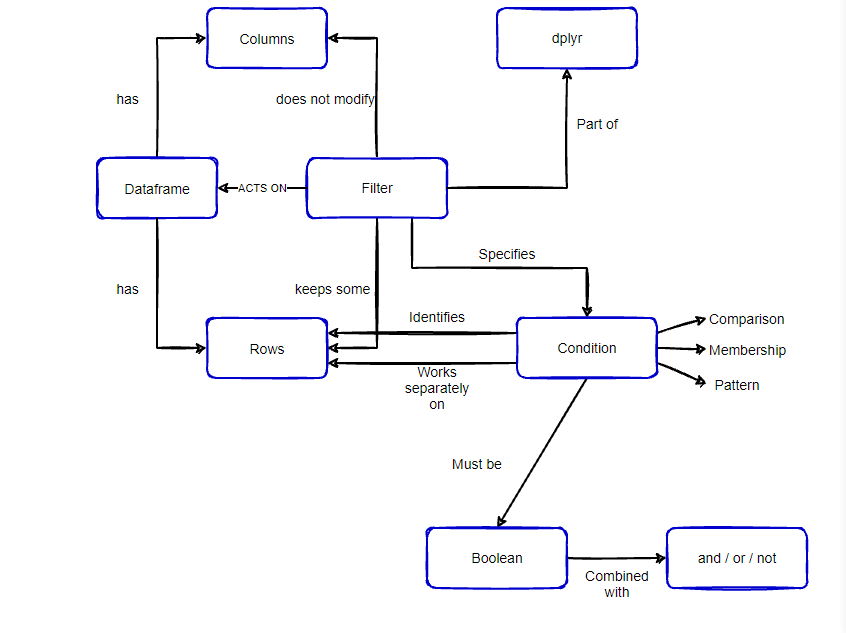

class: middle, center

```{r setup, include=FALSE}
options(htmltools.dir.version = FALSE)
knitr::opts_chunk$set(echo = TRUE)
library(tidyverse)
```

background-image: url("images/color-lens-filters.jpg")
background-position: center
background-size: cover

.right[
  .larger[.embolden[
  #R - Tidyverse
  #Dplyr Package  
  #filter() Function
  ]]
]

---

#Filter Concept Map

<center></center>

---

#Filter Concept Map

<center></center>

---

#Filter Concept Map

<center></center>

---

#Filter Concept Map

<center></center>

---

#Filter Concept Map

<center></center>

---

background-image: url("images/camera_filter_lens.jpg")
background-position: left bottom
background-size: 15%

# Filter to keep only what you need

- Retain the observations you need for further analysis
- Accomplish this by sub-setting the observations based on their values
- Acts on a data frame / tibble
- Does not modify columns, keeps some of the rows

<br>

--

- Syntax for filtering:

<br>

--

```{r filter-syntax, eval = FALSE}
  filter(object, criteria)
```

---

#Filter Concept Map

<center></center>

---

background-image: url("images/camera_filter_lens.jpg")
background-position: left bottom
background-size: 15%

#Comparison Operators

- Comparison operators are what you use to choose the observations you want
- The comparison operators specify a condition that needs to be met
- R provides the standard suite:

<br>

--

- `>`, `>=`, `<`, `<=`, `!=` (not equal), `==` (equal )

--

```{r comparison-operator, results="hide"}
  filter(starwars, species == "Human") %>% #<<
  select(!(homeworld:starships)) %>% slice_head(n=5)
```

--

.right[
```{r ref.label='comparison-operator', echo=FALSE}
```
]

---

background-image: url("images/camera_filter_lens.jpg")
background-position: left bottom
background-size: 15%

#Logical Operators

- Multiple arguments separated by "," within `filter()` are interpreted as "and" condition
- Every expression must be true in order for a row to be included in output
- For other types of combinations you'll need to use Boolean operators
  - `&` is "and"
  - `|` is "or"
  - `!` is "not"
  
--

```{r logical-operator, results="hide"}
  filter(starwars, species == "Human" & sex == "female") %>% #<<
  select(!(homeworld:starships)) %>% slice_head(n=5)
```

--

.right[
```{r ref.label='logical-operator', echo=FALSE}
```
]

---

background-image: url("images/camera_filter_lens.jpg")
background-position: left bottom
background-size: 15%

# Knowledge Check

_**Question**_: What does the `filter()` function modify in a data frame / tibble?

--

<br>
_**Answer**_: `filter()` modifys the rows (observations) within a data frame / tibble

--

<br>
_**Question**_: Which of these symbols is not a logical operator?  
  - a:   `|`  
  - b:   `&`  
  - c:   `/`  
  - d:   `!`  

--

_**Answer**_: `c` forward slash is not a logical operator. `a` is "or", `b` is "and", `d` is "not"

---

#Filter Concept Map

<center></center>

---

#Filter Concept Map

<center></center>

---

#Filter Concept Map

<center></center>

---

background-image: url("images/camera_filter_lens.jpg")
background-position: left bottom
background-size: 15%

# Filter() Example

- Say we want to find characters that have no hair and have a black eye color

--

```{r filter-example, results="hide"}
  filter(starwars, hair_color == "none" & eye_color =="black") %>%  #<<
  select(!(homeworld:starships)) %>% slice_head(n=5)
```

--

```{r ref.label='filter-example', echo=FALSE}
```

---

background-image: url("images/camera_filter_lens.jpg")
background-position: left bottom
background-size: 15%

# Fill in the Blank

_**Question**_: What characters from the Star Wars movies are either species of Wookiee or Twi'lek?

```{r filter-fillinblank, eval=FALSE}
  _____(starwars, _____ == "Wookiee" _ species __ _____) %>%  #<<
  select(!(homeworld:starships)) %>% slice_head(n=5)
```

--

_**Solution**_
```{r filter-fillinblank-soln, results="hide"}
  filter(starwars, species == "Wookiee" | species == "Twi'lek") %>%  #<<
  select(name, species, sex, homeworld, films) %>% slice_head(n=5)
```

--

.right[
```{r ref.label='filter-fillinblank-soln', echo=FALSE}
```
]

---

# Review Concept Map

<center></center>

---

class: top, center

background-image: url("images/color-lens-filters.jpg")
background-position: center
background-size: cover

.right[
  .larger[.embolden[
  #Topics covered during next session:
  <br>
  #------------------------
  ###Filter - How to Handle NA Values 
  ###Filter - Filtering When Grouping
  ###Filter - Overall Review
  #------------------------
  ]]
]

---

class: top, center

background-image: url("images/color-lens-filters.jpg")
background-position: center
background-size: cover

.right[
  .larger[.embolden[
  #Additional Resources for Filtering:
  <br>
  #------------------------
  ###R4DS Book: Filtering [link](https://r4ds.had.co.nz/transform.html#filter-rows-with-filter)
  ###Data Transformation Cheat Sheet: [link](https://raw.githubusercontent.com/rstudio/cheatsheets/main/data-transformation.pdf)
  #------------------------
  ]]
]

---

class: middle, center

background-image: url("images/color-lens-filters.jpg")
background-position: center
background-size: cover

.right[
  .larger[.embolden[
  #See you after the Break!
  ]]
]
